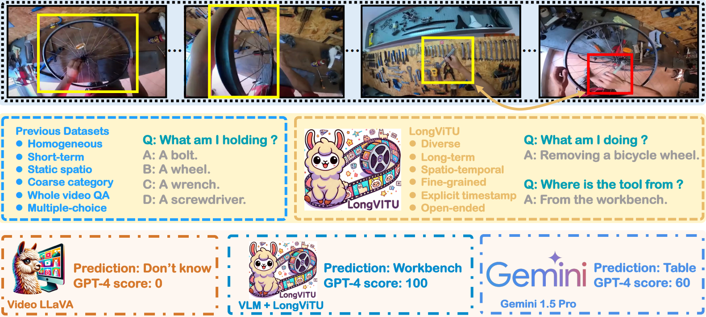
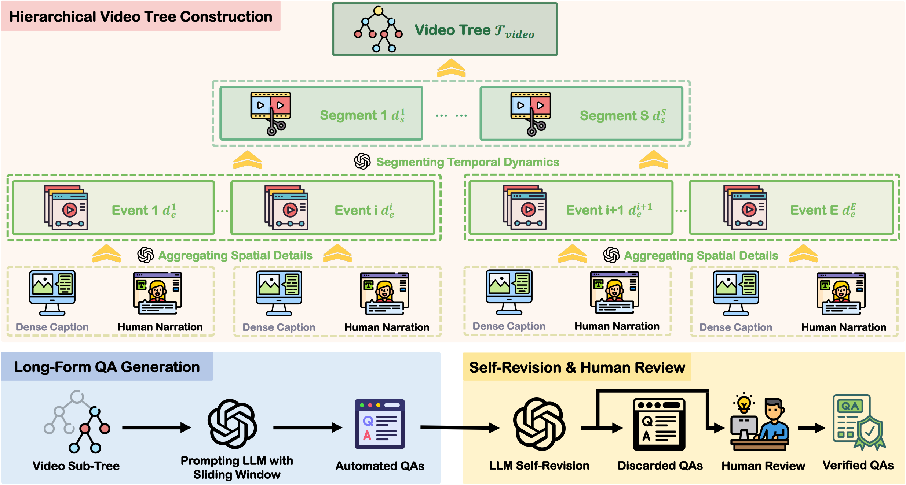

LongViTU
===
<p align="center"></p>

This repository hosts the code for our paper:

[LongViTU: Instruction Tuning for Long-Form Video Understanding](https://arxiv.org/pdf/2501.05037)

by [Rujie Wu](https://rujiewu.github.io/), [Xiaojian Ma](https://jeasinema.github.io/), [Hai Ci](https://haici.cc/), [Yue Fan](https://yuefan1014.github.io/), [Yuxuan Wang](https://patrick-tssn.github.io/), [Haozhe Zhao](https://haozhezhao.github.io/), [Qing Li](https://liqing.io/), [Yizhou Wang](https://cfcs.pku.edu.cn/english/people/faculty/yizhouwang/index.htm)

[arXiv](https://arxiv.org/abs/2501.05037) | [Paper](https://arxiv.org/pdf/2501.05037) | [Project page](https://rujiewu.github.io/LongViTU.github.io/) | [Dataset](https://huggingface.co/datasets/rujiewu/LongViTU)

## News
- 01/12/2025: 🎉🎉 [Code](https://github.com/rujiewu/LongViTU) and [Dataset](https://huggingface.co/datasets/rujiewu/LongViTU) have been released.
- 01/10/2025: 🎉🎉 Official [Project page](https://rujiewu.github.io/LongViTU.github.io/) has been launched.
- 01/09/2025: 🎉🎉 [ArXiv](https://arxiv.org/abs/2501.05037) preprint has been submitted.

## Abstract
This paper introduce LongViTU, a large-scale (~121k QA pairs, ~900h videos), automatically generated dataset for long-form video understanding. We developed a *systematic* approach that organizes videos into a ***hierarchical tree*** structure and incorporates ***self-revision*** mechanisms to ensure high-quality QA pairs. Each QA pair in LongViTU features: 1) long-term context (average *certificate length* of 4.6 minutes); 2) rich knowledge and condensed reasoning (commonsense, causality, planning, *etc.*); and 3) explicit timestamp labels for relevant events. LongViTU also serves as a benchmark for instruction following in long-form and streaming video understanding. We evaluate the open-source state-of-the-art long video understanding model, LongVU, and the commercial model, Gemini-1.5-Pro, on our benchmark. They achieve GPT-4 scores of 49.9 and 52.3, respectively, underscoring the substantial challenge posed by our benchmark. Further supervised fine-tuning (SFT) on LongVU led to performance improvements of 12.0% on our benchmark, 2.2% on the in-distribution (ID) benchmark EgoSchema, 1.0%, 2.2% and 1.2% on the out-of-distribution (OOD) benchmarks VideoMME (Long), WorldQA and OpenEQA, respectively. These outcomes demonstrate LongViTU's high data quality and robust OOD generalizability.

## Pipeline
<p align="center"></p>

We adopt a ***hierarchical*** pipeline that organizes video content into a tree structure, with subtrees encapsulating information at different temporal scales. This framework facilitates the generation of QA pairs with explicit timestamps, ensuring adaptability to varying contextual lengths. By summarizing content across multiple temporal levels (frame level, event level, segment level), our approach overcomes the challenge of excessively long input length for LLMs from long-form video. This enables LLMs to generate distinct types of questions, resulting in a fine-grained categorization aligned with the video content. To further enhance quality, a self-revision step refines results by removing redundancy and irrelevant prior information.

## Main Results
### Quantitative Results on LongViTU
All results are derived from evaluations conducted by GPT-4, the criteria and prompt are detailed in Appendix C in our [Paper](https://arxiv.org/pdf/2501.05037). * denotes results obtained in a *zero-shot* manner, while  indicates *fine-tuned* results following training on the LongViTU training set, $\triangle$ highlighting the percentage difference in performance between them. "Overall Avg." represents the average scores across three primary categories. The top-performing open-source model, LongVU, achieved a score of 55.9, surpassing the 52.3 score of the best commercial model, Gemini-1.5-pro.

#### Spatiotemporal Understanding
| Setting            | Method                  | Overall Avg.     | Object     | Attribute     | Location     | Action     | Avg.     |
|:-------------------|:------------------------|:----------------:|:----------:|:-------------:|:------------:|:----------:|:--------:|
| Blind              | GPT-4 turbo             | 38.2             | 26.1       | 33.2          | 32.0         | 29.4       | 30.2     |
| Frame-Based        | mPLUG-OWL*              | 42.4             | 33.5       | 37.6          | 43.6         | 35.4       | 37.8     |
|                    | Video-LLaVA*            | 45.9             | 37.8       | 46.3          | 49.1         | 38.1       | 42.7     |
|                    | Video-LLaVA**           | 50.7             | 39.3       | 49.2          | 49.6         | 41.8       | 44.9     |
|                    | $\triangle$ compared    | +10.5%           | +4.0%      | +6.3%         | +1.0%        | +9.7%      | +5.2%    |
| Sampling-Based     | VideoAgent*             | 44.0             | 35.7       | 43.1          | 45.9         | 36.4       | 40.2     |
|                    | LLaMA-VID*              | 38.2             | 29.4       | 35.6          | 40.1         | 31.5       | 34.3     |
|                    | LLaMA-VID**             | 44.5             | 33.5       | 37.4          | 45.7         | 37.6       | 39.1     |
|                    | $\triangle$ compared    | +16.5%           | +13.9%     | +5.1%         | +14.0%       | +19.4%     | +14.0%   |
|                    | LongVA-DPO*             | 47.5             | 35.9       | 52.4          | 44.3         | 37.2       | 41.8     |
|                    | LongVU*                 | 49.9             | 39.3       | 47.6          | 52.3         | 44.3       | 46.3     |
|                    | LongVU**                | 55.9             | 40.2       | 55.2          | 54.3         | 45.3       | 48.8     |
|                    | $\triangle$ compared    | +12.0%           | +2.3%      | +16.0%        | +3.8%        | +2.3%      | +5.4%    |
|                    | Gemini-1.5-Pro*         | 52.3             | 54.3       | 58.6          | 56.3         | 48.1       | 54.7     |

#### Episodic Reasoning
| Setting            | Method                  | Overall Avg.     | Transition     | Interaction     | Causality     | Motivation     | Avg.     |
|:-------------------|:------------------------|:----------------:|:--------------:|:---------------:|:-------------:|:--------------:|:--------:|
| Blind              | GPT-4 turbo             | 38.2             | 45.1           | 47.4            | 47.7          | 56.1           | 49.5     |
| Frame-Based        | mPLUG-OWL*              | 42.4             | 45.8           | 47.7            | 47.7          | 49.4           | 47.6     |
|                    | Video-LLaVA*            | 45.9             | 45.6           | 50.5            | 48.8          | 53.2           | 49.4     |
|                    | Video-LLaVA**           | 50.7             | 50.5           | 56.4            | 59.7          | 64.9           | 58.0     |
|                    | $\triangle$ compared    | +10.5%           | +10.7%         | +11.7%          | +22.3%        | +22.0%         | +17.4%   |
| Sampling-Based     | VideoAgent*             | 44.0             | 43.1           | 45.5            | 49.9          | 52.8           | 48.1     |
|                    | LLaMA-VID*              | 38.2             | 40.4           | 46.7            | 40.5          | 46.6           | 43.2     |
|                    | LLaMA-VID**             | 44.5             | 46.7           | 48.4            | 54.2          | 57.7           | 52.1     |
|                    | $\triangle$ compared    | +16.5%           | +15.6%         | +3.6%           | +33.8%        | +23.8%         | +20.6%   |
|                    | LongVA-DPO*             | 47.5             | 51.8           | 54.6            | 52.2          | 59.5           | 54.8     |
|                    | LongVU*                 | 49.9             | 56.7           | 58.8            | 48.9          | 53.4           | 54.2     |
|                    | LongVU**                | 55.9             | 62.4           | 63.5            | 63.2          | 70.0           | 65.2     |
|                    | $\triangle$ compared    | +12.0%           | +10.1%         | +8.0%           | +29.2%        | +31.1%         | +20.3%   |
|                    | Gemini-1.5-Pro*         | 52.3             | 47.8           | 45.5            | 47.8          | 47.5           | 47.3     |

#### Commonsense Inference
| Setting            | Method                  | Overall Avg.     | Planning     | Risk     | Function     | Affordance     | Avg.     |
|:-------------------|:------------------------|:----------------:|:------------:|:--------:|:------------:|:--------------:|:--------:|
| Blind              | GPT-4 turbo             | 38.2             | 36.5         | 51.1     | 55.9         | 50.9           | 48.7     |
| Frame-Based        | mPLUG-OWL*              | 42.4             | 42.1         | 54.6     | 54.3         | 51.5           | 50.3     |
|                    | Video-LLaVA*            | 45.9             | 41.6         | 56.8     | 55.3         | 54.6           | 51.7     |
|                    | Video-LLaVA**           | 50.7             | 50.2         | 62.6     | 64.0         | 64.6           | 59.8     |
|                    | $\triangle$ compared    | +10.5%           | +20.7%       | +10.2%   | +15.7%       | +18.3%         | +15.7%   |
| Sampling-Based     | VideoAgent*             | 44.0             | 40.0         | 53.7     | 55.5         | 53.1           | 50.7     |
|                    | LLaMA-VID*              | 38.2             | 34.9         | 51.3     | 46.5         | 47.2           | 44.1     |
|                    | LLaMA-VID**             | 44.5             | 43.9         | 54.5     | 55.7         | 53.8           | 51.7     |
|                    | $\triangle$ compared    | +16.5%           | +25.8%       | +6.2%    | +19.8%       | +14.0%         | +17.2%   |
|                    | LongVA-DPO*             | 47.5             | 46.3         | 57.0     | 61.9         | 59.2           | 56.1     |
|                    | LongVU*                 | 49.9             | 46.2         | 52.3     | 60.4         | 62.8           | 56.0     |
|                    | LongVU**                | 55.9             | 59.9         | 67.9     | 68.7         | 70.4           | 66.4     |
|                    | $\triangle$ compared    | +12.0%           | +29.7%       | +29.8%   | +13.7%       | +12.1%         | +18.6%   |
|                    | Gemini-1.5-Pro*         | 52.3             | 43.6         | 57.5     | 46.1         | 43.6           | 50.3     |

### Quantitative results on additional benchmarks
The * denotes results obtained in a *zero-shot* manner, while ** indicates *fine-tuned* results following training on the LongViTU training set, $\triangle$ highlighting the percentage difference in performance between their. Denote $s_2$ as the *stage 2* and $s_3$ as the *stage 3*, they are strictly following LLaMA-VID. The zero-shot results of LongViTU on VideoMME are reproduced from the official checkpoint on [Hugging Face](https://huggingface.co/Vision-CAIR/LongVU_Qwen2_7B), rather than those reported in the [arXiv](https://arxiv.org/pdf/2410.17434).

| Method                  | EgoSchema     | VideoMME | Short     | Medium     | Long     | WorldQA     | OpenEQA  | ScanNet     | HM3D     |
|:------------------------|:-------------:|:--------:|:---------:|:----------:|:--------:|:-----------:|:--------:|:-----------:|:--------:|
| VideoLLM Online*        | 47.4          | 13.7     | 24.3      | 16.7       | 0.0      | 30.0        | 23.3     | 24.8        | 20.4     |
| LLaMA-VID$*s_3$         | 23.6          | 14.6     | 19.5      | 12.6       | 11.5     | 30.9        | 31.1     | 31.0        | 31.3     |
| LLaMA-VID$*s_2$         | 30.4          | 16.7     | 22.6      | 15.3       | 12.2     | 32.0        | 31.9     | 31.8        | 32.1     |
| LLaMA-VID**             | 34.0          | 17.2     | 23.8      | 15.4       | 12.2     | 32.2        | 33.6     | 33.5        | 33.8     |
| $\triangle$ compared    | +11.8%        | +3.0%    | +5.3%     | +0.7%      | +0.0%    | +0.6%       | +5.3%    | +5.3%       | +5.3%    |
| Video-LLaVA*            | 36.8          | 32.3     | 33.7      | 31.6       | 31.5     | 30.2        | 35.1     | 37.3        | 30.9     |
| Video-LLaVA**           | 48.1          | 32.5     | 30.5      | 33.7       | 33.1     | 34.1        | 32.6     | 32.6        | 32.5     |
| $\triangle$ compared    | +30.7%        | +0.6%    | -9.5%     | +6.6%      | +5.1%    | +12.9%      | -7.1%    | -12.6%      | +5.2%    |
| LongVA-DPO*             | 56.9          | 54.3     | 61.6      | 50.4       | 47.6     | 30.3        | 36.6     | 41.5        | 26.9     |
| LLaVA-OneVision*        | 60.1          | 58.2     | 69.1      | 53.3       | 46.7     | -           | -        | -           | -        |
| LongVU*                 | 67.6          | 56.2     | 66.1      | 54.7       | 47.9     | 35.7        | 48.3     | 51.1        | 42.8     |
| LongVU**                | 69.1          | 56.3     | 65.8      | 54.7       | 48.4     | 36.5        | 48.9     | 51.4        | 44.2     |
| $\triangle$ compared    | +2.2%         | +0.2%    | -0.5%     | +0.0%      | +1.0%    | +2.2%       | +1.2%    | +0.6%       | +3.3%    |

## Installation
For each codebase, please refer to their respective installation guidelines: [Video-LLaVA](https://github.com/PKU-YuanGroup/Video-LLaVA), [LLaMA-VID](https://github.com/dvlab-research/LLaMA-VID) and [LongVU](https://github.com/Vision-CAIR/LongVU).

##  Data Preparation
Download all the videos from [Ego4D](https://ego4d-data.org/) and all the annotation files from our [Dataset](https://huggingface.co/datasets/rujiewu/LongViTU). The data should be placed to `dataset` and the file structure looks like:
```plain
LongViTU
├── dataset
│   └── longvitu
│       ├── videos
│       │   ├── 0000_ed90c2e8-c608-423f-a565-7b4cfffbe438.mp4
│       │   ├── 0001_80d2d992-0765-4fd9-b75b-7334cfefbd6f.mp4
│       │   ├── ... ...
│       │   └── 1832_cdfd99eb-88c6-4bc7-8f66-e0318216feab.mp4
│       ├── segmented_videos
│       │   ├── 0000_ed90c2e8-c608-423f-a565-7b4cfffbe438
│       │   │   ├── 000000.mp4
│       │   │   └── ... ...
│       │   ├── 0001_80d2d992-0765-4fd9-b75b-7334cfefbd6f
│       │   ├── ... ...
│       │   └── 1832_cdfd99eb-88c6-4bc7-8f66-e0318216feab
│       │       ├── ... ...
│       │       └── 121143.mp4
│       ├── longvitu_train_101k.json
│       ├── longvitu_valid_14k.json
│       └── longvitu_test_6k.json
├── ... ...
└── train_longvitu_qwen.sh
```

## Video-LLaVA
```bash
cd Video-LLaVA
bash finetune.sh
bash inference.sh
```

## LLaMA-VID
```bash
cd LLaMA-VID
bash finetune.sh
bash inference.sh
```

## LongVU
```bash
cd LongVU
bash train_longvitu_qwen.sh
python scripts/consolidate_checkpoint.py --model_path output/cambrian_qwen2_7b_longvitu_train_101k/checkpoint-xxxx
bash eval.sh
```

## LLaVA-Video
```bash
cd LLaVA-Video
bash train.sh
bash eval.sh
```

## Acknowledgement
Thanks for the codebase of [Video-LLaVA](https://github.com/PKU-YuanGroup/Video-LLaVA), [LLaMA-VID](https://github.com/dvlab-research/LLaMA-VID) and [LongVU](https://github.com/Vision-CAIR/LongVU).

## License
- Code: [Apache](LICENSE)
- Data: [CC BY-NC-SA 4.0](https://creativecommons.org/licenses/by-nc-sa/4.0/deed.en)

## Citation
If you find LongViTU helpful for your research, please consider citing our paper.
```
@misc{wu2025longvituinstructiontuninglongform,
      title={LongViTU: Instruction Tuning for Long-Form Video Understanding}, 
      author={Rujie Wu and Xiaojian Ma and Hai Ci and Yue Fan and Yuxuan Wang and Haozhe Zhao and Qing Li and Yizhou Wang},
      year={2025},
      eprint={2501.05037},
      archivePrefix={arXiv},
      primaryClass={cs.CV},
      url={https://arxiv.org/abs/2501.05037}, 
}
```